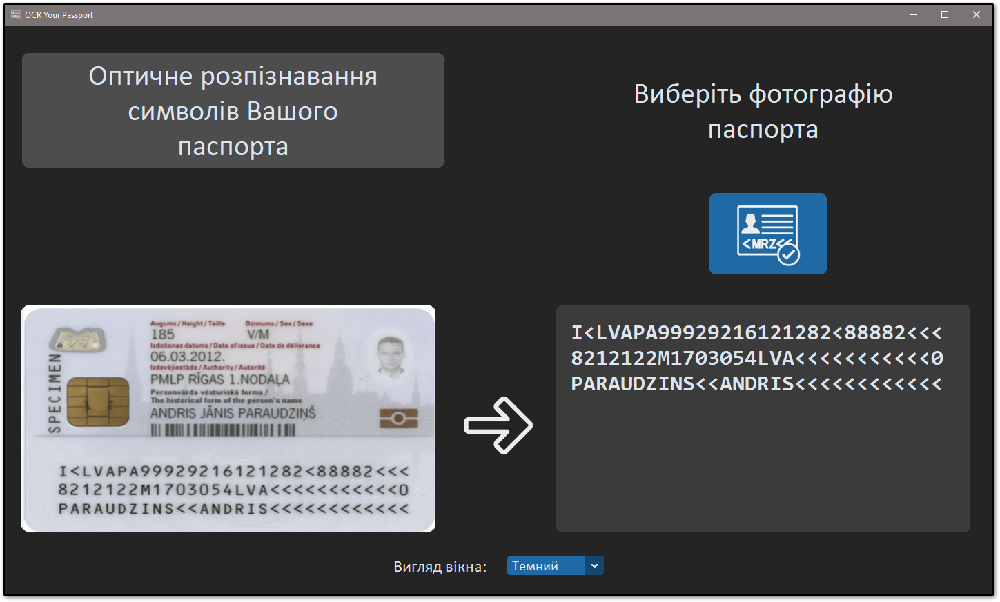

# OCR-Passports
 OCR Passports with Tesseract and OpenCV. Project for MAN (Minor Academy of Sciences of Ukraine).

---

| _`GUI.py` on Windows 10 with dark mode and standart 'blue' theme. An example of the program's work._
